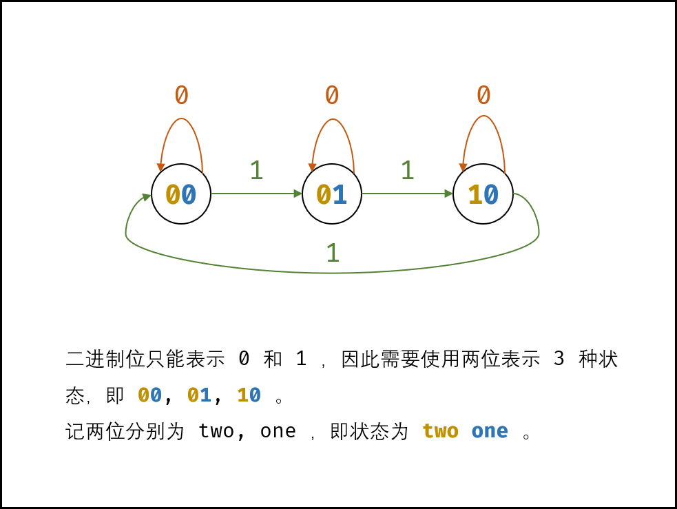
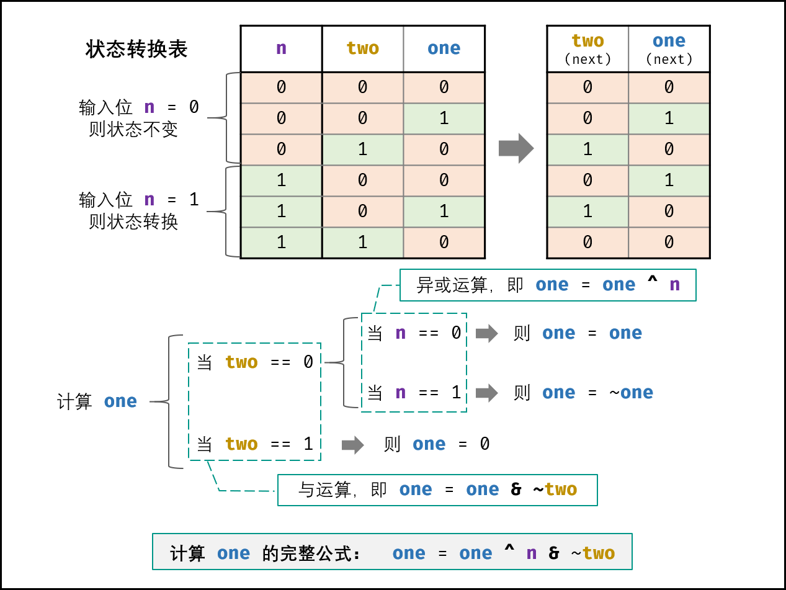
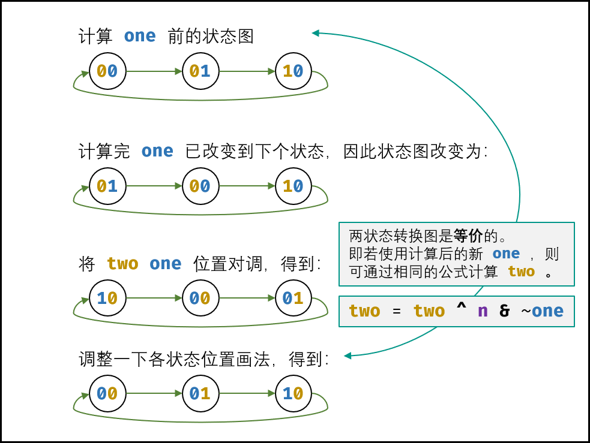

# [137. 只出现一次的数字 II](https://leetcode-cn.com/problems/single-number-ii/)

给定一个**非空**整数数组，除了某个元素只出现一次以外，其余每个元素均出现了三次。找出那个只出现了一次的元素。

**说明：**

你的算法应该具有线性时间复杂度。 你可以不使用额外空间来实现吗？

**示例 1:**

```
输入: [2,2,3,2]
输出: 3
```

**示例 2:**

```
输入: [0,1,0,1,0,1,99]
输出: 99
```


链接：https://leetcode-cn.com/problems/single-number-ii

## 题解：

### 不考虑空间复杂度

### 1 hashset

将输入数组存储到 HashSet，然后使用 HashSet 中数字和的三倍与数组之和比较。

$3x(a+b+c)-(a+a+a+b+b+b+c)=2c$

```go
func singleNumber1(nums []int) int {
	set := make(map[int]int)
	sum1, sum2 := 0, 0
	for _, num := range nums {
		sum2 += num
		if _, ok := set[num]; !ok {
			set[num] = 1
			sum1 += num

		}
	}
	return (3*sum1 - sum2) / 2
}
```

### 2 hashmap

用哈希表记录元素的个数

```go
func singleNumber2(nums []int) int {
	hashmap := make(map[int]int)
	for _, num := range nums {
		hashmap[num]++
	}
	for k, count := range hashmap {
		if count == 1 {
			return k

		}
	}
	return 0
}
```

### 3 位遍历

把每一个想象成一个64位或者32位长的二进制数组，遍历所有的数，按位相加，最后，将数组中所有数按mod=3取余数，再遍历求结果

```
func singleNumber3(nums []int) int {
	res := [64]int{}
	for _, num := range nums {
		for i := 0; i < 64; i++ {
			res[i] += num & 1
			num = num >> 1
		}
	}
	r := 0
	for i := 0; i < 64; i++ {
		res[i] = res[i] % 3
		r += res[i] << i
	}
	return r
}
```

### 考虑空间复杂度 

### 4 状态机

各二进制位的 位运算规则相同 ，因此只需考虑一位即可。如下图所示，对于所有数字中的某二进制位 11 的个数，存在 3 种状态，即对 3 余数为 0, 1, 2。

- 若输入二进制位 1 ，则状态按照以下顺序转换；
- 若输入二进制位 0 ，则状态不变。
  


如下图所示，由于二进制只能表示 0, 10,1 ，因此需要使用两个二进制位来表示 3 个状态。设此两位分别为 two , one ，则状态转换变为：
00→01→10→00→⋯



接下来，需要通过 状态转换表 导出 状态转换的计算公式 。首先回忆一下位运算特点，对于任意二进制位 xx ，有：

- 异或运算：x ^ 0 = x ， x ^ 1 = ~x

- 与运算：x & 0 = 0 ， x & 1 = x

  

**计算 one方法：**

设当前状态为 two，one ，此时输入二进制位 n 。如下图所示，通过对状态表的情况拆分，可推出 one 的计算方法为：

``` 
if two == 0:
  if n == 0:
    one = one
  if n == 1:
    one = ~one
if two == 1:
    one = 0
```


引入 异或运算 ，可将以上拆分简化为：

``` 
if two == 0:
    one = one ^ n
if two == 1:
    one = 0
```

引入 与运算 ，可继续简化为：

`one = one ^ n & ~two`





**计算 two方法：**

由于是先计算 one，因此应在新 one的基础上计算 two 。
如下图所示，修改为新 one 后，得到了新的状态图。观察发现，可以使用同样的方法计算 two ，即：

`two = two ^ n & ~one`



**返回值：**

以上是对数字的二进制中 “一位” 的分析，而 int 类型的其他 31 位具有相同的运算规则，因此可将以上公式直接套用在 32 位数上。

遍历完所有数字后，各二进制位都处于状态 00 和状态 01 （取决于 “只出现一次的数字” 的各二进制位是 11 还是 00 ），而此两状态是由 one来记录的（此两状态下 twos 恒为 00 ），因此返回 ones 即可。

复杂度分析：
时间复杂度 O(N) ： 其中 NN 位数组nums 的长度；遍历数组占用 O(N)，每轮中的常数个位运算操作占用 O(1)O(32×3×2)=O(1) 。
空间复杂度 O(1) ： 变量 ones , twos使用常数大小的额外空间。


###  