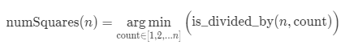
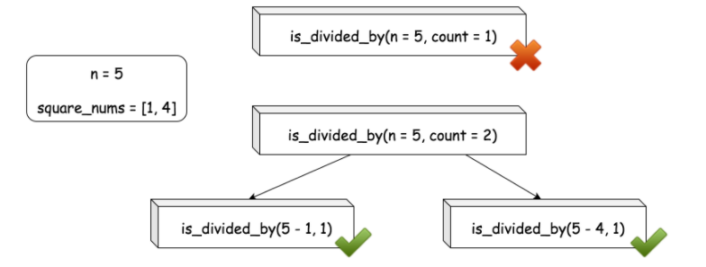
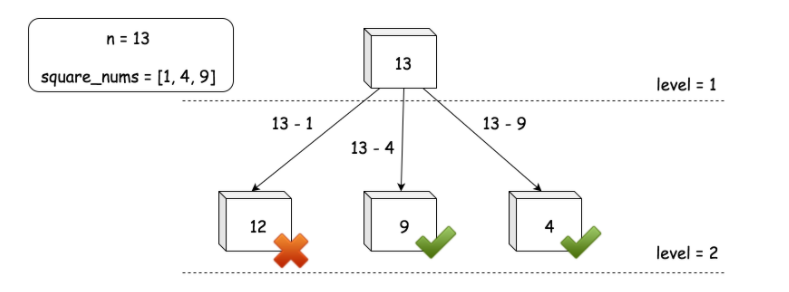
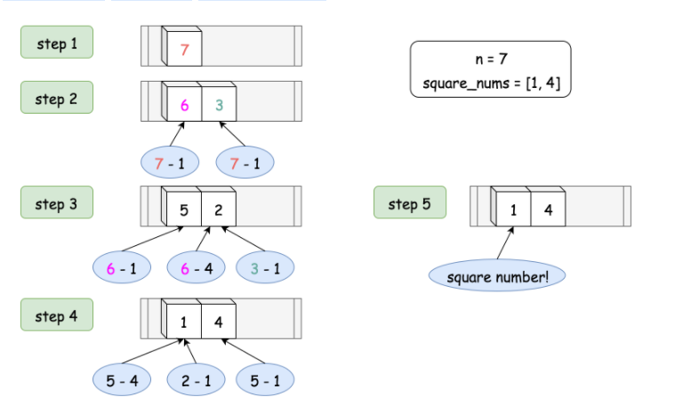

# 279 完全平方数

[toc]


## 题目描述


给定正整数 n，找到若干个完全平方数（比如 1, 4, 9, 16, ...）使得它们的和等于 n。你需要让组成和的完全平方数的个数最少。

示例 1:

>输入: n = 12 
>输出: 3 
>解释: 12 = 4 + 4 + 4.

示例 2:

> 输入: n = 13
> 输出: 2
> 解释: 13 = 4 + 9.


## 方法一  自顶向上的动态规划 

 效率最差 1216ms 

```go
func numSquares1(n int) int {
	// 1216ms
	if n <= 3 {
		return n
	}
	table := map[int]int{}
	var x int
	var i int
	for i = 1; i <= n; i++ {
		x = i * i
		if x > n {
			break
		}
		table[x] = 1
	}
	i = i - 2
	dp := make([]int, n+1)
	dp[0] = 1
	dp[1] = 1
	dp[2] = 2
	dp[3] = 3

	for i := 4; i <= n; i++ {
		if table[i] == 1 {
			dp[i] = 1
			continue
		}
		var min = n + 1
		for j := 1; j < i; j++ {
			if dp[j]+dp[i-j] < min {
				min = dp[j] + dp[i-j]
			}
		}
		dp[i] = min

	}
	return dp[n]
}
```

状态转移方程为 `dp[i]=min(dp[j]+dp[i-j])  其中 j为1...i-1`  

时间复杂度为o(n2)


## 方法2   自上向下的的动态规划，用数组计算过程

效率 100ms 

```
func numSquares(n int) int {
	// 100 ms 
	if n <= 3 {
		return n
	}
	dp:=make([]int,n+1)
	list:=[]int{}
	var x int
	var i int
	for i = 1; i <= n; i++ {
		x = i * i
		if x > n {
			break
		}
		dp[x]=1
		list=append(list,x)
	}
	dp[0] = 0
	dp[1] = 1
	dp[2] = 2
	dp[3] = 3
	dp[4] = 1
	lenl:=len(list)
	var help func(n int)int
	help =func(n int)int{
		if dp[n]!=0{
			return dp[n]
		}
		min:=n+1
		for i:=lenl-1;i>=0;i--{
			if n-list[i]>0{
				if min>help(n-list[i]){
					min=help(n-list[i])
				}
			}
		}
		dp[n]=min+1
		return dp[n]
	}
	return help(n)
```

时间复杂度为存疑问？？


## 方法3 贪心枚举 

侠侣 12ms 

```go
func numSquares(n int) int {
	//12 ms 
	if n <= 3 {
		return n
	}
	table := map[int]int{}
	var x int
	var i int
	for i = 1; i <= n; i++ {
		x = i * i
		if x > n {
			break
		}
		table[x] = 1
	}
	
	var isDividedBy func(n,count int)bool
	isDividedBy=func(n,count int)bool{
		if count ==1{
			return table[n]>0
		}
		for k:=range table{
			if isDividedBy(n-k,count-1){
				return true
			}
		}
		return false
	}
	for i:=1;i<=n;i++{
		if isDividedBy(n,i){
			return i
		}
	}
	return 0
}

```

> leetcode 题解 
>
> 递归解决方法为我们理解问题提供了简洁直观的方法。我们仍然可以用递归解决这个问题。为了改进上述暴力枚举解决方案，我们可以在递归中加入贪心。我们可以将枚举重新格式化如下：
>
> 从一个数字到多个数字的组合开始，一旦我们找到一个可以组合成给定数字 n 的组合，那么我们可以说我们找到了最小的组合，因为我们贪心的从小到大的枚举组合。
>
> 为了更好的解释，我们首先定义一个名为 is_divided_by(n, count) 的函数，该函数返回一个布尔值，表示数字 n 是否可以被一个数字 count 组合，而不是像前面函数 numSquares(n) 返回组合的确切大小。
>
> 
>
> 与递归函数 numSquare(n) 不同，is_divided_by(n, count) 的递归过程可以归结为底部情况（即 count==1）更快。
>
> 下面是一个关于函数 is_divided_by(n, count) 的例子，它对 输入 n=5 和 count=2 进行了分解。
>
> 
>
> 
>
> 通过这种重新构造的技巧，我们可以显著降低堆栈溢出的风险。
>
> 算法：
>
> 首先，我们准备一个小于给定数字 n 的完全平方数列表（称为 square_nums）。
> 在主循环中，将组合的大小（称为 count）从 1 迭代到 n，我们检查数字 n 是否可以除以组合的和，即 is_divided_by(n, count)。
> 函数 is_divided_by(n, count) 可以用递归的形式实现，汝上面所说。
> 在最下面的例子中，我们有 count==1，我们只需检查数字 n 是否本身是一个完全平方数。可以在 square_nums 中检查，即 n \in \text{square\_nums}n∈square_nums。如果 square_nums 使用的是集合数据结构，我们可以获得比 n == int(sqrt(n)) ^ 2 更快的运行时间。
>
> 关于算法的正确性，通常情况下，我们可以用反证法来证明贪心算法。这也不例外。假设我们发现 count=m 可以除以 n，并且假设在以后的迭代中存在另一个 count=p 也可以除以 n，并且这个数的组合小于找到的数，即 p<m。如果给定迭代的顺序，count = p 会在 count=m 之前被发现，因此，该算法总是能够找到组合的最小大小。

## 方法四 贪心+BFS(广度优先搜索)


```
func numSquares(n int) int {
	//60 ms
	if n <= 3 {
		return n
	}
	list := make([]int, 0)
	var x int
	var i int
	for i = 1; i <= n; i++ {
		x = i * i
		if x > n {
			break
		}
		list = append(list, x)
	}
	lenl := len(list)
	level := 0
	set := make(map[int]int)
	var nextSet map[int]int
	set[n] = 1
	var sqrNum int
	for len(set) > 0 {
		level++
		nextSet = map[int]int{}
		for k := range set {
			for i := 0; i < lenl; i++ {
				sqrNum = list[i]
				if k == sqrNum {
					return level
				}
				if k > sqrNum {
					nextSet[k-sqrNum] = 1
				} else {
					break
				}
			}

		}
		set = nextSet
	}
	return level

}
```

>leetcode题解：
>
>给定一个 N 元树，其中每个节点表示数字 n 的余数减去一个完全平方数的组合，我们的任务是在树中找到一个节点，该节点满足两个条件：
>
>(1) 节点的值（即余数）也是一个完全平方数。
>(2) 在满足条件（1）的所有节点中，节点和根之间的距离应该最小。
>
>下面是这棵树的样子。
>
>   
>
> 在前面的方法3中，由于我们执行调用的贪心策略，我们实际上是从上到下逐层构造 N 元树。我们以 BFS（广度优先搜索）的方式遍历它。在 N 元树的每一级，我们都在枚举相同大小的组合。
>
>遍历的顺序是 BFS，而不是 DFS（深度优先搜索），这是因为在用尽固定数量的完全平方数分解数字 n 的所有可能性之前，我们不会探索任何需要更多元素的潜在组合。
>
>算法：
>
>- 首先，我们准备小于给定数字 n 的完全平方数列表（即 square_nums）。
>- 然后创建 queue 遍历，该变量将保存所有剩余项在每个级别的枚举。
>- 在主循环中，我们迭代 queue 变量。在每次迭代中，我们检查余数是否是一个完全平方数。如果余数不是一个完全平方数，就用其中一个完全平方数减去它，得到一个新余数，然后将新余数添加到 next_queue 中，以进行下一级的迭代。一旦遇到一个完全平方数的余数，我们就会跳出循环，这也意味着我们找到了解。
>- 注意：在典型的 BFS 算法中，queue 变量通常是数组或列表类型。但是，这里我们使用 set 类型，以消除同一级别中的剩余项的冗余。事实证明，这个小技巧甚至可以增加 5 倍的运行加速。
>
>在下图中，我们以 numSquares(7) 为例说明队列的布局。
>
>
>
>


